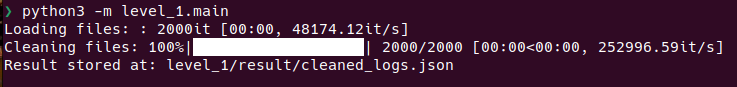

# Assignment Solutions
## Table of Content
- [How to setup](#how-to-setup)
    - [Setup python env](#setup-python-environment)
    - [Setup mysql Server](#set-up-mysql-server)
- [Level 1 solution](#level-1)
    - [How to run](#run-run-data-cleaning-pipeline)
    - [File Setup](#file-setup)
- [Data Details](#data-details)
    - [Schema](#schmea)
- [Level 2 solution](#level-2)
    - [How to run](#run-injestion-pipeline)
    - [File Setup](#file-setup-1)
- [Level 3 solution](#level-3)


## How to setup
### Setup Python Environment
1. [Install uv](https://docs.astral.sh/uv/getting-started/installation/#standalone-installer)

2. Install depedencies and create virtual environment run following command.

    ```bash
    uv sync
    ```

3. Activate virtual environment run following command:
    ```bash
    source .venv/bin/activate
    ``` 

### Set up mysql server
        
If docker is install run following command.

```
docker run -p 3306:3306 -e MYSQL_USER=admin -e MYSQL_PASSWORD=admin -e MYSQL_ROOT_PASSWORD=root -e MYSQL_DATABASE=default mysql:latest
```


## **Level 1**
In this problem we have to extract log data from files in `application` directory, clean it and store in single json format at `level_1/result/cleaned_logs.json`.

### **Run run data cleaning pipeline**
- Be in root directory.
- Run following command:

    ```bash
    python3 -m level_1.main
    ```
    **Output:** 

    

### File setup
```
level_1
├── __init__.py
├── clean_logs.py # convert logs in json format
├── get_logs.py  # extract raw logs from log files
├── main.py
├── pipeline.py
├── result
│   └── cleaned_logs.json
└── store_logs.py # store cleaned logs json file
```

## Data details

**Trial applications on Inato:**
Table name is `Logs`

- `id`: application ID
- `therapeutic_area`: therapeutic area of the study for which the site is applying
- `created_at`: timestamp when the study application started
- `site_name`: name of the site who took part in the trial
- `site_category`: category the site who took part in the trial

### Schmea
```
+------------------+--------------+------+-----+---------+-------+
| Field            | Type         | Null | Key | Default | Extra |
+------------------+--------------+------+-----+---------+-------+
| id               | varchar(100) | NO   | PRI | NULL    |       |
| therapeutic_area | varchar(100) | NO   |     | NULL    |       |
| created_at       | datetime     | NO   |     | NULL    |       |
| site_name        | varchar(100) | NO   |     | NULL    |       |
| site_category    | varchar(100) | NO   |     | NULL    |       |
+------------------+--------------+------+-----+---------+-------+
```

## **Level 2**
- In this problem we have to injest cleaned log data to mysql database.
- I used `sqlalchemy` ORM to create schema and data injestion.
- Here I ran mysql docker container. See [Setup mysql](#set-up-mysql-server) section.


### Add sql connection in project
- Open file `level_2/connection.py`
- Here you can add connection string by modifying `connection_str` variable.


### Run injestion pipeline
Make sure you setup mysql server. Instruction  given above.

Run following command:
```bash
python3 -m level_2.main
```


### **Check data injested or not**
- Run following command and copy mysql `CONTAINER ID`.
    ```
    docker ps
    ```
- Run following command to enter mysql terminal, 
    - Replace <container id> with previously copyed container id.
    - Replace <username> with `admin`.
    ```bash
    docker exec -it <container id> mysql -u admin -p 
    ```
- It will prompt you to enter password i.e `admin`, by default.
- Change db
    ```mysql
    use default
    ``` 
- See rows
    ```mysql
    select * from Logs limit 2;
    ```

      

### File setup

```
level_2
├── connection.py
├── ingestion.py
├── __init__.py
├── main.py
└── schema.py # define schema 
```


## **Level 3**
In this problem we have to run two sql quries on database. Data details can we seen in this [section](#data-details)

**Query 1** 

Oncology specialization rate: Calculate the ratio of applications for oncology trials to the total number of applications for each Academic site.

```mysql
select site_name,
       sum(case when therapeutic_area = "oncology" then 1 else 0 end) / count(*) as oncology_rate
from Logs
where site_category = "academic"
group by site_name;
```
**Output** 

  

**Query 2**

List of sites: Provide a list of sites that applied to at least 10 trials during the 14 days following their first application.

```mysql
select x.site_name, count(*)
from (select
          site_name,
          date(created_at) event_date,
          min(date(created_at)) over (partition by site_name) as min_date
    from Logs) as x
where event_date between min_date and adddate(min_date, 14)
group by site_name
having count(*) >= 10;
```

**Output** 

 